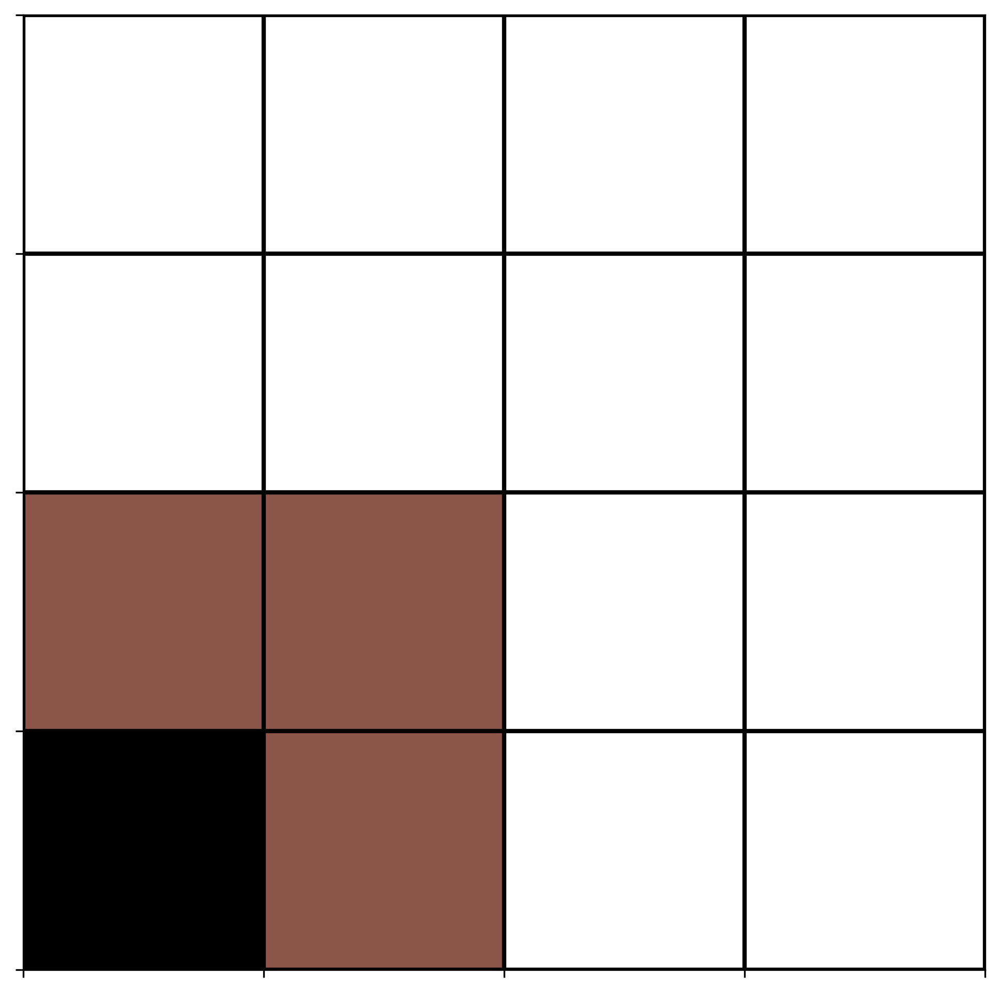

<div align="center">

# 🌐 **Programa 1** 📡


# **Adoquinamiento**


</div>


<div align="center">

[](https://www.youtube.com/watch?v=fregObNcHC8)

</div>


---
El problema de **Adoquinamiento** (Tiling Problem) consiste en que se desea adoquinar una cuadrícula de $m × m$ con adoquines en
forma de “L”, como los siguientes:

<div align="center">

```Haskell

|----|            |----|  |----|----|  |----|----|
| *  |            | *  |  | *  | *  |  | *  | *  |
|----|----|  |----|----|  |----|----|  |----|----|
| *  | *  |  | *  | *  |       | *  |  | *  |     
|----|----|  |----|----|       |----|  |----|     


```

</div>

Las condiciones son las siguientes:

- $m = 2^k$ es decir $m$ debe ser potencia de $2$.
- En la cuadrícula existirá un “cuadro especial” que será puesto de
manera arbitraria en la cuadrícula y no podrá ser cubierto por ninguna otra pieza.

Es por esto que el programa recibe como entrada en los argumentos
de la línea de comandos (ejecutando desde la carpeta ’src’) un entero
positivo $k$, el cuál indicará el tamaño de nuestra cuadrícula a adoquinar.

<div align="center">

Con $k=1$, tendremos $2^1=m=2$

Con $k=2$, tendremos $2^2=m=4$

Con $k=3$, tendremos $2^3=m=8$

Con $k=4$, tendremos $2^4=m=16$

Con $k=5$, tendremos $2^5=m=32$

Con $k=6$, tendremos $2^6=m=64$

Con $k=7$, tendremos $2^7=m=128$

.

.

.

Con $k=n$, tendremos $2^n=m=z$


</div>

---

## **Uso**

Para correr el programa que genera el Adoquinamiento de una cuadricula de $m × m$ con $m = 2^k$.
- Compilar desde `src/`:

Linux  : 

```Haskell
\src> python3 Programa01A.py <k>
```

Windows:  

```Python
\src> python Programa01A.py <k>
```

En donde:

```Julia
<k> = El exponente de 2 para nuestra formula de 2^k
```

Una vez realizado esto, el programa se ejecutara y al terminar generará una imagen con el Adoquinamiento final ademas de un gif con el paso a paso sobre como se realizo. 

Nota: Entre mas grande la $k$, mayor tiempo requerira el programa para generar el Gif, en caso de querer generar **solo** la imagen de una $k$ muy grande (5-6 en adelante), es recomendable el "comentar" en codigo el
generador de Gifs para poder generar la imagen del adoquinamiento mas rapido (esto con el costo de que el programa no genere su corresponiente Gif).

----

# **Ejemplos de uso**

```Julia
\src> python Programa01A.py 4
```

<div align="center">


</div>


```Julia
\src> python Programa01A.py 3
```

<div align="center">


</div>


```Julia
\src> python Programa01A.py 2
```

<div align="center">




</div>


```Julia
\src> python Programa01A.py 1
```

<div align="center">


</div>


